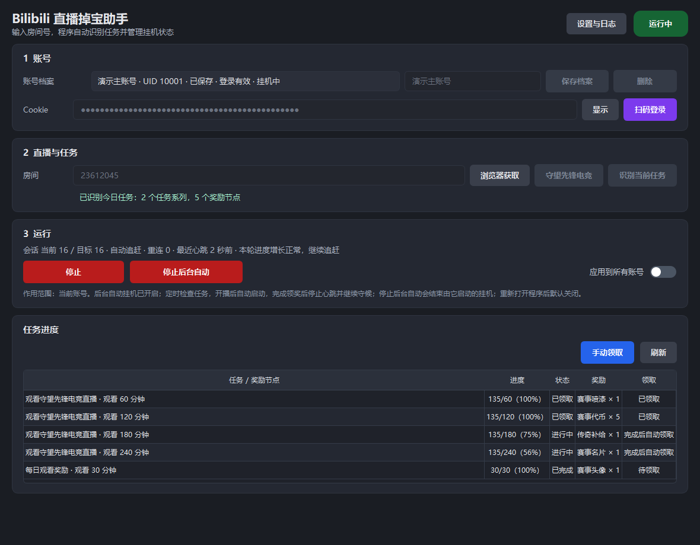
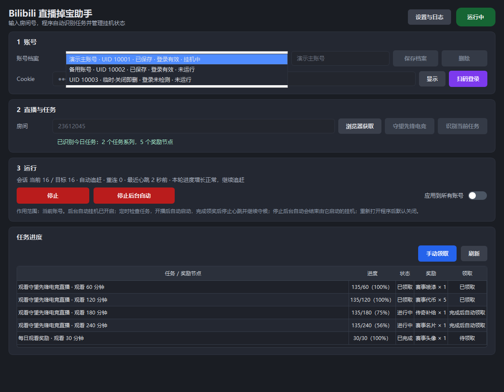
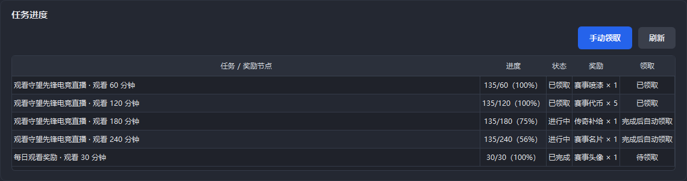
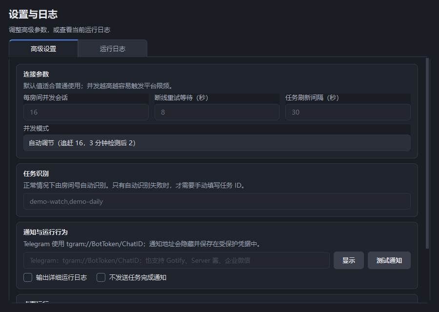

# BiliDrop v2.0.0

BiliDrop 是面向 Windows 的 Bilibili 直播掉宝助手。登录账号并填写直播间后，它可以发送
观看心跳、识别当天任务、展示每个奖励节点的进度，并在达标后自动领取奖励。

> **下载最新版：** [前往 GitHub Releases 下载 BiliDrop](https://github.com/JumpTwiceShou/bilidrop/releases/latest)

> 仅供个人学习研究使用。请遵守平台规则；过高并发可能触发限频或风控。

[v2.0.0 更新说明](docs/release-notes-v2.0.0.md) ·
[旧版本升级指南](docs/migration-v2.md) ·
[架构说明](docs/architecture.md)



## 核心能力

| 能力 | 说明 |
| --- | --- |
| 程序内扫码登录 | 直接调用 Bilibili 二维码接口，不为登录打开浏览器 |
| 多账号同时挂机 | 已保存账号和临时账号分别运行，切换档案不会停止其他账号 |
| 当天任务完整展示 | 同时显示当天全部任务及 60/120/180/240 分钟等奖励节点 |
| 自动领取奖励 | 每个节点达标后独立领取，手动领取只作为失败兜底 |
| 后台自动挂机 | 定时检查任务和开播状态，到时间自动启动，完成后停止心跳并继续守候 |
| 自动或固定并发 | 自动模式根据实际进度从追赶阶段切换到稳定阶段，也可手动固定并发 |
| 安全本地存储 | Cookie、通知地址和设置正文使用当前 Windows 用户的 DPAPI 加密 |
| Windows 桌面集成 | 单实例运行、深色标题栏、系统托盘和单文件 EXE |

## 快速开始

1. 启动单文件 EXE，点击“扫码登录”，使用手机 Bilibili App 扫描程序内二维码。
2. 输入直播间号或直播间 URL；守望先锋赛事可以直接点击“守望先锋电竞”。
3. 点击“识别当前任务”，程序会读取当天全部任务并立即填充任务进度表。
4. 点击“开始”发送观看心跳。任务尚未识别或识别失败时也可以直接挂机。
5. 需要无人值守时点击“后台自动挂机”；程序会在任务开始且直播开播后自动启动。

“应用到所有账号”开关同时决定“开始/停止”和“后台自动挂机”操作当前账号还是全部账号。
按钮启动后会原位变成“停止”或“停止后台自动”，不会额外铺开一排停止按钮。

后台自动挂机不会随程序启动。每次重新打开程序后都需要由用户手动开启，避免意外启动
挂机；普通“开始”也不会在程序启动时自动执行。

## 多账号工作区



- 再次扫码可以创建新的临时账号，不会覆盖原来已保存、临时或正在挂机的账号。
- 账号选择器会显示备注、UID、`已保存`/`临时·关闭即删`、登录状态和挂机状态。
- 每个账号分别保存房间、任务、进度和运行状态；切换账号只切换管理视图。
- 临时账号只存在于当前进程内，退出程序后删除；只有明确保存的账号才会在下次启动时出现。
- 同 UID 再次扫码会更新原档案的 Cookie，同时保留用户填写的备注。
- 登录失效的档案不能启动挂机，界面会提示重新扫码。

## 任务进度与奖励



识别成功后，程序会立即查询并显示当天可以进行的全部任务，无需再手动刷新。Bilibili
可能把多个观看奖励放在一个外层任务中；BiliDrop 会把每个奖励节点拆成独立一行，而不是
只显示一个外层任务。

节点状态按接口结果区分：

- `进行中`：观看进度尚未达到节点要求。
- `待领取`：节点已经达标，程序将自动尝试领取。
- `已领取`：平台已确认奖励领取完成。

领取使用每个奖励节点自己的 `sid`。领奖和状态查询串行执行，失败后按 1/5/15/60 分钟
冷却退避，避免刷新或重复点击造成接口限频。“手动领取”只用于自动领取失败后的重试。

## 任务识别

任务识别不是开始挂机的前置条件。只要 Cookie 和房间号有效，就可以发送观看心跳；识别
任务的作用是显示进度、自动领取和发送完成通知。

程序按以下顺序发现任务：

1. 使用当前账号 Cookie 直接读取房间活动数据。
2. 解析当前 EVA 嵌套活动数据和旧版 `window.__initialState` 任务结构。
3. 直接数据没有任务时，使用真正不创建白色窗口的无头 Chrome/Edge 后台兜底。
4. 后台方式失败后，“识别当前任务”自动启动可见浏览器流程作为人工兜底。
5. 可见浏览器仍兼容旧版 `/x/task/totalv2` 网络响应捕获。

直播间没有开播也可以识别任务。页面明确没有任务时会快速结束并提示仍可直接挂机，不会
一直等到浏览器超时。识别过程中按钮会切换为“取消识别”。

## 后台自动挂机

后台自动挂机适合需要长期守候活动的账号：

- 当前任务默认每 15 分钟检查一次。
- 提前发现的未来任务默认每 60 分钟检查一次，并在开始时间重新唤醒。
- 任务开始且直播开播后自动启动观看心跳。
- 当天所有节点完成并确认最后一次领奖后停止心跳，但保留低频任务轮询。
- 先开启后台自动、之后再填写房间或识别任务时会立即检查，不必等待下一轮定时器。
- 点击“停止后台自动”会停止轮询，并停止由后台自动功能启动的挂机；用户手动开始的
  挂机不会被误停。

## 自动并发

默认每房间并发为 16，新账号默认使用自动模式：

- 手动开始且缺少可靠任务开始时间时，先以 16 个会话追赶。
- 3 分钟内进度至少增加 16 时继续追赶；否则降到 2 个会话并保持到下一组新任务。
- 后台自动检测到刚开始且初始进度为 0 的新任务时，直接以 2 个会话稳定运行。
- 运行区会显示当前/目标会话数、自动追赶或自动稳定阶段，以及本轮判断依据。

需要完全自行控制时，可以在“设置与日志”中改为固定并发。

## 设置、日志与通知



窗口右上角的“设置与日志”包含：

- 自动/固定并发、并发会话数、断线重试和任务刷新间隔。
- Telegram Bot、Gotify、Server 酱和企业微信通知地址。
- 最小化到托盘、关闭到托盘和详细日志选项。
- 脱敏诊断导出以及实时运行日志。

Telegram 地址格式为 `tgram://BotToken/ChatID`。任务通知包含账号名称或 UID、直播间、
任务名称、完成进度和领奖结果。通知地址默认遮蔽并保存在受保护凭据中。

三个数字参数都是纯数字输入框，没有加减按钮，也不会响应鼠标滚轮改值。

## 凭据与本地数据

程序设置、账号备注、最近选择状态、加密 Cookie 和加密通知地址统一保存在：

```text
%LOCALAPPDATA%\BiliDrop\credentials.json
```

- Cookie、通知地址和设置正文由 Windows DPAPI 保护，只能由当前 Windows 用户解密。
- 程序目录旁不会产生配套的 Cookie 或设置 JSON。
- 未保存 Cookie 只存在内存中；程序退出后不会再次加载。
- 启动时默认选择上次使用的已保存档案，没有已保存档案时显示空白临时账号。
- 脱敏诊断不包含 Cookie、通知地址、浏览器数据或令牌。

首次启动 v2 时，程序会兼容旧版 `cookies.json` 列表和
`{ "cookies": [...] }` 格式。旧文件与新 EXE 位于同一目录时，程序先将账号和备注加密
写入统一存储并回读校验；只有验证成功后，才把旧文件移动到
`%LOCALAPPDATA%\BiliDrop\legacy\`。如果迁移失败，原文件保持不动。

Windows DPAPI 数据不能直接复制给其他 Windows 用户或其他设备使用。

## 源码运行

建议使用独立虚拟环境：

```powershell
python -m venv .venv
.\.venv\Scripts\Activate.ps1
python -m pip install -r requirements.txt
python bilibili_gui.py
```

开发和测试依赖：

```powershell
python -m pip install -r requirements-dev.txt
python -m pytest
```

## CLI

```powershell
python bilibili.py `
  --cookie "SESSDATA=xxx; bili_jct=xxx" `
  --rooms "23612045" `
  --threads 16 `
  --task-ids "taskId1,taskId2"
```

主要参数：

```text
--cookie COOKIE                 Bilibili 登录 Cookie
--rooms ROOMS                   房间号、直播间 URL，多个用逗号分隔
--threads THREADS               每房间异步会话数，默认 16，范围 1–128
--reconnect-delay SECONDS       重连延迟，范围 5–3600 秒
--task-ids TASK_IDS             可选任务 ID；GUI 正常流程无需手动填写
--task-interval SECONDS         账号级任务查询间隔，范围 10–3600 秒
--notify-urls URLS              通知地址，多个用逗号或换行分隔
--disable-task-notify           关闭任务完成通知
-v, --verbose                   输出详细日志
```

命令行参数可能出现在终端历史记录中。不要把真实 Cookie 写入仓库、脚本或示例文件。

## 打包单文件 EXE

默认构建单文件 GUI，输出为 `dist/bilibili-drops-miner-gui.exe`：

```powershell
python -m pip install -r requirements-build.txt
python build.py --target gui --clean
```

需要保留正在运行的旧文件时，可以追加输出后缀：

```powershell
python build.py --target gui --clean --name-suffix unattended
```

只有本地开发排障需要展开目录时，才使用 `--onedir`。

## 项目文档

- [v2.0.0 完整更新说明](docs/release-notes-v2.0.0.md)
- [v2 架构与线程模型](docs/architecture.md)
- [旧版 Cookie 和配置迁移](docs/migration-v2.md)
- [本地环境说明](docs/env.md)
- [配置示例](config.example.json)

## 来源与许可

BiliDrop 基于 [mi0e/BiliBiliDropsMiner](https://github.com/mi0e/BiliBiliDropsMiner)
维护，采用 [MIT License](LICENSE)。本项目不保证平台页面或接口长期稳定，也不提供规避
平台限制或风控的能力。
